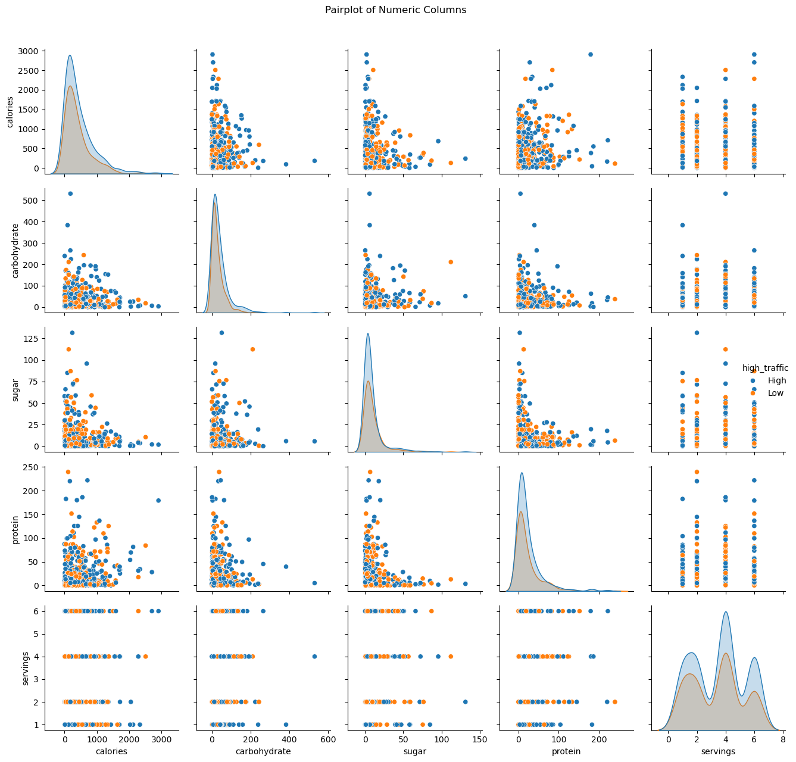

# High-Traffic Recipe Prediction

## Overview
This repository focuses on predicting recipes that generate high traffic for a Grocery App's official webpage. The Grocery App, initially designed for grocery shopping, observed a significant increase in traffic (29%) when posting certain recipes on their webpage.

In response to this discovery, an analyst on the team identified recipes that generated high traffic on the day of posting. It's important to note that this list is not exhaustive.

## Objective
The goal for data scientists involved in this project is to analyze the provided data and uncover patterns in the relationship between recipes and their popularity. The objective is to gain insights into the factors that contribute to a recipe becoming popular, enabling accurate predictions of high-traffic recipes to be posted on the website daily.

## Dataset
The dataset contains information about recipes that have historically generated high traffic. Data scientists will explore, analyze, and model this dataset to extract meaningful patterns and develop a predictive model.

## Key Tasks
1. **Data Exploration:** Dive into the dataset to understand its structure, variables, and potential patterns. [Link to Notebook](data_analysis.ipynb)
2. **Analysis:** Uncover insights into the characteristics of recipes that lead to high traffic. [Link to Notebook](data_analysis.ipynb)
3. **Model Development:** Build a predictive model to accurately forecast popular recipes.
4. **Evaluation:** Assess the model's performance and refine as necessary for optimal predictions.

**Data Exploration and Analysis**

## License
This project is licensed under the MIT License - see the [LICENSE](LICENSE) file for details.