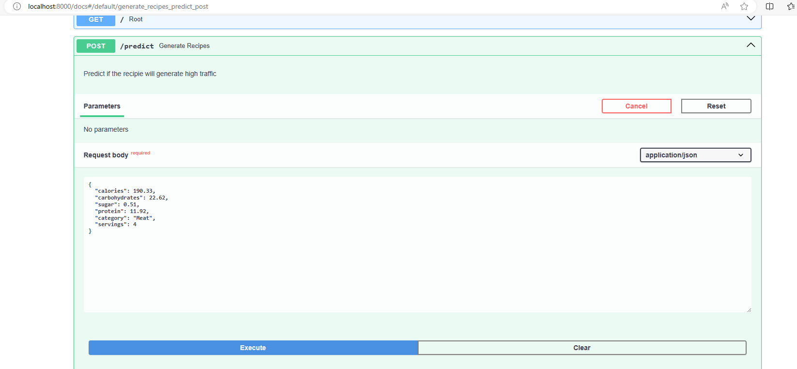

# Interactive API Endpoints

A dormant model holds untapped potential until it actively contributes value. Interaction is key to unlocking its utility. Tailored to address the business challenge at hand, the incorporation of API endpoints serves as an effective means to engage with the model.

In alignment with the business objective, the model exposes API endpoints, offering an interface for internal teams to request predictions for high-traffic recipes. This not only facilitates the display of compelling content on the website but also establishes a valuable feedback loop.

The model's interactivity is amplified through the provision of API endpoints, empowering internal staff to assess and rate the likelihood of a recipe generating high traffic.

Utilizing FastAPI, chosen for its efficiency and comprehensive self-documenting capabilities, the API encompasses:

- **Category Mapping**: Each category is meticulously mapped for clarity and consistency.
  
- **Input Validation Class**: Ensures that incoming data adheres to specified criteria, enhancing the robustness of the system.

- **Service Encapsulation**: The API encapsulates the service, seamlessly formatting input and generating predictions, contributing to a cohesive and user-friendly experience.

* To run the app
```bash
pip install -r ../requirements.txt
uvicorn --host localhost main:app
```
* To interact with the endpoint: use thw Swagger docs `http://ip-address:port/docs` the values for ip-address and port need to be set appropriately.
**Demo**



**Things Learnt**
* The Fastapi package needs the predictions to be encodeable. [Link to helpful post](https://stackoverflow.com/questions/69543228/trouble-fixing-cannot-convert-dictionary-update-sequence-element-0-to-a-seque)